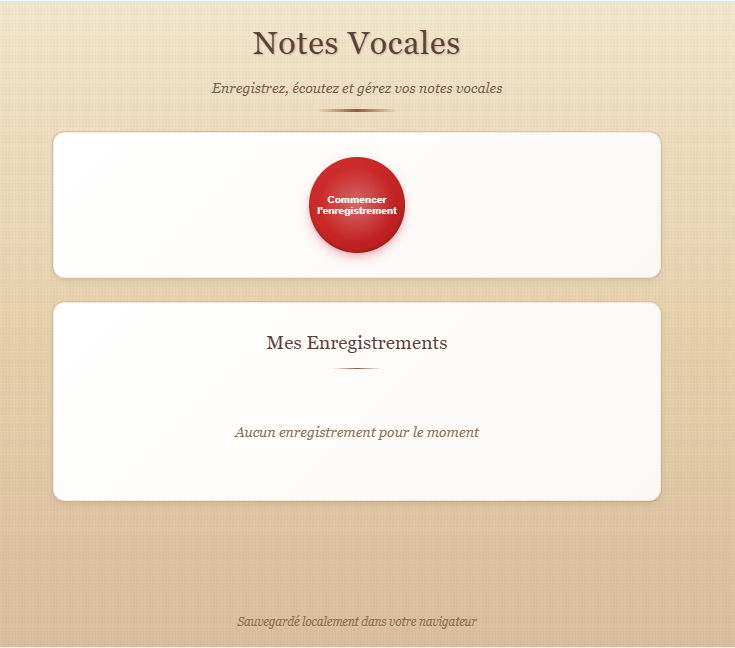

# Voice_Note

## Description
Application web permettant d’enregistrer, écouter et gérer des notes vocales directement depuis le navigateur.  
Ce projet est le **trente-et-unième** du défi personnel **100 projets en 2026**.

---

## Objectifs du projet
- Utiliser les APIs du navigateur (MediaRecorder)
- Manipuler des fichiers audio (Blob)
- Implémenter un CRUD avec du contenu média
- Gérer des enregistrements audio en local
- Structurer une application interactive

---

## Plateforme
- Web (navigateur)

---

## Technologies utilisées
- HTML
- CSS
- JavaScript (Vanilla)
- Web API : MediaRecorder
- LocalStorage (ou IndexedDB en option)

---

## Fonctionnalités
- Démarrer un enregistrement audio
- Arrêter l’enregistrement
- Lecture des notes vocales
- Liste des enregistrements
- Suppression d’une note
- Sauvegarde locale des données

---

## Design & UX
- Bouton d’enregistrement central et visible
- Indicateur visuel pendant l’enregistrement
- Liste claire des notes avec lecteur audio
- Interface minimaliste et fonctionnelle
- Responsive (mobile et desktop)

---

## Captures d’écran

---

## Ce que j’ai appris
- Utilisation de l’API MediaRecorder
- Manipulation de Blob et fichiers audio
- Gestion d’un CRUD avec des médias
- Interaction avec des APIs natives du navigateur
- Structuration d’une application plus avancée

---

## Améliorations possibles
- Nommer les enregistrements
- Afficher la durée des audios
- Télécharger les fichiers audio
- Visualisation d’onde sonore
- Utilisation d’IndexedDB pour stockage avancé

---

## Statut du projet
 **Projet terminé**